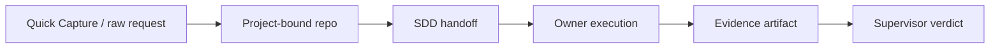

# Multica Ultimate Workbench

> A durable operating memory layer for coordinating Codex, Claude Code, and Hermes agents on top of Multica.

[](WORKBENCH_LOG.md)
[](https://github.com/Fearvox/multica-ultimate-workbench)
[](#two-ring-system)
[](#self-awareness)
[](#sdd-workflow)
[](#goal-mode)
[](#l2-pressure)
[](agents/AGENT_ROSTER.md)
[](agents/AGENT_ROSTER.md)
[](agents/AGENT_ROSTER.md)
[](docs/flight-recorder.md)
[](docs/skill-curator.md)
[](docs/capy-process-check-lane.md)
[](docs/sanity-unified-context-lane.md)
[](docs/agent-install-unifier-lane.md)
[](docs/flue-agent-harness-lane.md)
[](#documentation-map)

**Jump to:** [Overview](#overview) · [Architecture](#architecture) · [Two-Ring System](#two-ring-system) · [Self-Awareness](#self-awareness) · [SDD](#sdd-workflow) · [Goal Mode](#goal-mode) · [L2 Pressure](#l2-pressure) · [Capy Process Check](#capy-process-check-lane) · [Sanity Context](#sanity-unified-context-lane) · [Agent Install](#agent-install-unifier-lane) · [Flue Harness](#flue-agent-harness-lane) · [Runtime Model](#agent-runtime-model) · [Commands](#commands) · [Docs](#documentation-map) · [中文总览](#中文总览)

## Overview

Multica Ultimate Workbench is the durable operating memory for a multi-agent workbench built on top of Multica. Multica remains the live collaboration layer for agents, issues, comments, direct chat, runtimes, skills, and autopilots. This repository preserves the operating model around that layer — roles, decisions, templates, safety rules, verification scripts, and review discipline — in Git, where it can be versioned, diffed, and audited independently of the live workspace.

## Why It Exists

Agent collaboration gains power from structure. Direct chat is good for fuzzy thought; real execution needs owners, evidence, review gates, and memory that survives the session. This repo provides those rails without modifying Multica's daemon, Desktop UI, or core runtime. It is the workbench's long-term memory — the part that persists when chat scrolls away.

## Architecture

The workbench separates live execution from durable operating memory:

| Layer | Owns | Source |
| --- | --- | --- |
| Multica | Live agents, issues, comments, runtimes, skills, autopilots | Multica workspace |
| This repo | Strategy, roles, templates, review rules, logs, helper scripts | Git |
| Sanity context | Sanitized structured context for CLIs | Sanity Studio / GROQ / MCP |
| Agent-install lane | Skills, MCPs, AGENTS.md distribution | Native agent config |
| Flue lane | Deployable agent harnesses for mature workflows | Flue project source |
| Human operator | Scope, approval, taste, final judgment | You |

The workbench also accepts a small external review surface: the `Capy Git
Dialogue Lane`. Captain Capy and other external coding agents should use commit
subjects, PR titles/descriptions, and review comments as durable, reviewable
signals back into the workbench. Those artifacts complement Multica's live
coordination; they do not replace it, and they do not authorize daemon, Desktop
UI, or core runtime mutation.

## Two-Ring System

The system uses two rings instead of a flat swarm to keep agent coordination manageable.

| Ring | Role | Job |
| --- | --- | --- |
| Inner Ring | Admin, Supervisor, Synthesizer | Turn fuzzy work into issues, review evidence, keep memory coherent. |
| Outer Ring | Developer, Researcher, Architect, Docs, QA, Ops, Curator | Execute bounded specialist work without taking over routing. |

See [agents/AGENT_ROSTER.md](agents/AGENT_ROSTER.md) for the full role map and ring assignments.

## Self-Awareness

Self-Awareness is the workbench's first bootstrap layer. Before non-trivial
work, an agent posts `SELF_AWARENESS_BOOTSTRAP`: runtime identity, role
boundary, repo anchor, tool/MCP envelope, memory sources checked, current-state
proof, risk boundary, route, success metric, and operator-call conditions.

It keeps current evidence ahead of old memory, prevents wrong-runtime/tool
assumptions, and routes work into SDD, Goal Mode, L2 Pressure, VM execution,
child issues, or Supervisor review as needed. It is public-safe by design: no
raw environment dumps, secrets, live IDs, request payloads, or raw transcripts.

See [skills/workbench-self-awareness-infra.md](skills/workbench-self-awareness-infra.md) and [docs/self-awareness-infra-layer.md](docs/self-awareness-infra-layer.md).

## SDD Workflow

Non-trivial work follows Specification-Driven Development:

```text
raw requirement → product design → technical design → task list → execution/review
```

Each stage is recorded as a structured issue comment. Issue status stays coarse-grained; the detailed workflow lives in comments and review labels.

## Goal Mode

Goal Mode is the workbench wrapper for `/goal` tasks: the assigned owner locks the objective, keeps it alive across turns and reruns, and does not claim completion until the relevant build, test, smoke, docs/report, git-status, and evidence gates are addressed.

It is not a permission override. Destructive actions, credentials, public/private boundary changes, and live runtime mutations still require the normal approval and Supervisor review path.

See [skills/workbench-goal-mode.md](skills/workbench-goal-mode.md).

## L2 Pressure

L2 Pressure is the Research Vault grounding layer for remote Hermes, VM, and HarnessMax work. Before routing or claiming a high-pressure autonomous path, the owner posts `RV_PRESSURE_CHECK`: what vault source was checked, which prior failures or proven patterns matter, how they changed the route, and whether the result is `PASS`, `FLAG`, or `BLOCK`.

Remote runtimes start read-only. The approved remote RV MCP surface is `vault_status`, `vault_search`, `vault_taxonomy`, and `vault_get`; writes, ingest, deletion, maintenance, and broad raw export require separate approval and Supervisor review.

See [skills/workbench-l2-pressure-gate.md](skills/workbench-l2-pressure-gate.md) and [docs/remote-rv-mcp.md](docs/remote-rv-mcp.md).

## Agent + Runtime Model

Codex, Claude Code, and Hermes are assigned by role, not treated as interchangeable text boxes:

| Runtime family | Typical use |
| --- | --- |
| Codex | Implementation, review, QA, ops checks, risk control. |
| Claude Code | Architecture, documentation, planning, admin synthesis. |
| Hermes | Research, memory synthesis, broader context digestion. |

## Workspace Skills

Workspace skills are the shared grammar of the workbench. They make high-frequency behavior explicit — SDD, conductor routing, research, implementation, review, docs release, browser proofshot QA, token/context discipline, L2 pressure, and memory synthesis.

See [skills/README.md](skills/README.md) for the live skill map and attachment design.

## Multica 0.2.22 Platform

Multica 0.2.22 provides the platform surfaces the workbench builds on: project-bound repos, Quick Capture intake, fresh reruns, Mermaid rendering, per-agent model config, and safer custom env handling. The workbench uses these as routing and evidence rails — they extend what the workbench can do, but do not replace SDD or Supervisor review.



See [docs/multica-021-workflow.md](docs/multica-021-workflow.md) for the platform capability map.

## Flight Recorder

The flight recorder produces a compact issue-level digest — metadata, comments, runs, verdict markers, checkout evidence, and run-message counts — as a `RUN_DIGEST`. It is not full telemetry and does not persist raw payloads by default.

```bash
./scripts/collect-flight-recorder.sh <issue-id>
```

See [WORKBENCH_METRICS.md](WORKBENCH_METRICS.md) and [docs/flight-recorder.md](docs/flight-recorder.md).

## Capy VM Lane

A controlled VM/Computer execution path for GUI, browser, sandbox, and screenshot-backed tasks. It does not replace Multica routing or Supervisor review; it gives assigned agents a disposable execution cell when shell-only work is insufficient.

```bash
./scripts/vm-smoke.sh
```

See [docs/capy-vm-lane.md](docs/capy-vm-lane.md).

## Capy Process Check Lane

Capy Process Check is the lightweight Brave/Computer Use lane for observing Capy task, thread, PR, and review state in real time. It is deliberately simple: read the UI, compare it against GitHub CLI or repo evidence, and publish a compact `CAPY_PROCESS_CHECK`.

Capy UI is supporting evidence, not the source of truth. Merge, done, and release claims still require GitHub, CI, repo, or review evidence.

See [docs/capy-process-check-lane.md](docs/capy-process-check-lane.md), [skills/workbench-capy-process-check.md](skills/workbench-capy-process-check.md), and [issue-templates/capy-process-check.md](issue-templates/capy-process-check.md).

## Sanity Unified Context Lane

Sanity is the structured context registry for cross-CLI workbench state. It stores sanitized records such as agent profiles, runtime surfaces, skill contracts, evidence events, decisions, handoffs, and Capy process checks so different CLIs can query the same context without loading the same long prompt.

Sanity does not store secrets, raw logs, OAuth material, raw transcripts, raw request payloads, private screenshots, or unreviewed memory overrides.

See [docs/sanity-unified-context-lane.md](docs/sanity-unified-context-lane.md), [skills/workbench-sanity-context.md](skills/workbench-sanity-context.md), and [issue-templates/sanity-context-schema.md](issue-templates/sanity-context-schema.md).

## Agent-Install Unifier Lane

The agent-install lane distributes reviewed skills, MCP server definitions, and AGENTS.md sections across supported coding agents. It is a sync layer, not a governance layer: Multica and this repo still own routing, SDD, review gates, and final acceptance.

See [docs/agent-install-unifier-lane.md](docs/agent-install-unifier-lane.md), [skills/workbench-agent-install-unifier.md](skills/workbench-agent-install-unifier.md), and [issue-templates/agent-install-unifier.md](issue-templates/agent-install-unifier.md).

## Flue Agent Harness Lane

Flue is the deployable agent harness outlet for mature workbench workflows. When a workflow should become a reusable HTTP agent, CI reviewer, Node service, Cloudflare Worker, or sandbox-backed coding/support agent, the owner writes a `FLUE_AGENT_CONTRACT` and packages the smallest useful Flue scaffold.

The lane does not replace Multica, SDD, Goal Mode, L2 Pressure, or Supervisor review. It turns stable workbench behavior into deployable agent code while keeping live routing and evidence gates in Multica.

See [docs/flue-agent-harness-lane.md](docs/flue-agent-harness-lane.md), [skills/workbench-flue-agent-harness.md](skills/workbench-flue-agent-harness.md), and [issue-templates/flue-agent-scaffold.md](issue-templates/flue-agent-scaffold.md).

## Skill Curator

The maintenance protocol for keeping workbench skills useful over time. It reviews stale skills, overlapping instructions, role-binding drift, token/context risk, and recoverable archive candidates. Version 1 is review-only — it proposes changes through issues instead of silently deleting or rewriting skills.

See [docs/skill-curator.md](docs/skill-curator.md) and [issue-templates/curator-review.md](issue-templates/curator-review.md).

## Autopilots

Autopilots create issues for recurring checks — daily health, auto-review sweeps, remote HarnessMax evolve sweeps, dependency review, stale-memory checks, skill-curator checks, benchmark-artifact checks. They are scheduled entry points into the review pipeline; they do not silently execute high-risk work.

See [autopilots/daily-health.md](autopilots/daily-health.md), [autopilots/auto-review-sweeper.md](autopilots/auto-review-sweeper.md), and [autopilots/remote-harnessmax-evolve-sweeper.md](autopilots/remote-harnessmax-evolve-sweeper.md).

## Commands

Read-only helpers (safe to run anytime):

```bash
./scripts/list-workbench-state.sh
./scripts/collect-flight-recorder.sh <issue-id>
```

Source regeneration:

```bash
./scripts/generate-create-commands.sh
```

Human approval required before running:

```bash
./scripts/create-pilot-agent.sh
./scripts/create-agent-roster.sh
```

## Documentation Map

| Need | File |
| --- | --- |
| Agent operating manual | [AGENTS.md](AGENTS.md) |
| Current strategy and architecture | [SYNTHESIS.md](SYNTHESIS.md) |
| Decision log | [DECISIONS.md](DECISIONS.md) |
| Historical rollout log | [WORKBENCH_LOG.md](WORKBENCH_LOG.md) |
| Flight recorder contract | [WORKBENCH_METRICS.md](WORKBENCH_METRICS.md) |
| Self-awareness bootstrap | [docs/self-awareness-infra-layer.md](docs/self-awareness-infra-layer.md) |
| Self-awareness skill | [skills/workbench-self-awareness-infra.md](skills/workbench-self-awareness-infra.md) |
| Goal-persistence contract | [skills/workbench-goal-mode.md](skills/workbench-goal-mode.md) |
| L2 pressure gate | [skills/workbench-l2-pressure-gate.md](skills/workbench-l2-pressure-gate.md) |
| Remote Research Vault MCP | [docs/remote-rv-mcp.md](docs/remote-rv-mcp.md) |
| VM execution lane | [docs/capy-vm-lane.md](docs/capy-vm-lane.md) |
| Capy process check lane | [docs/capy-process-check-lane.md](docs/capy-process-check-lane.md) |
| Sanity unified context lane | [docs/sanity-unified-context-lane.md](docs/sanity-unified-context-lane.md) |
| Agent-install unifier lane | [docs/agent-install-unifier-lane.md](docs/agent-install-unifier-lane.md) |
| Flue agent harness lane | [docs/flue-agent-harness-lane.md](docs/flue-agent-harness-lane.md) |
| Platform workflow (0.2.22) | [docs/multica-021-workflow.md](docs/multica-021-workflow.md) |
| Skill curator protocol | [docs/skill-curator.md](docs/skill-curator.md) |
| Workspace skill map | [skills/README.md](skills/README.md) |
| Agent roster | [agents/AGENT_ROSTER.md](agents/AGENT_ROSTER.md) |
| Remote agent cell (NYC) | [agents/remote/nyc-remote-agents.md](agents/remote/nyc-remote-agents.md) |
| Issue templates | [issue-templates/](issue-templates/) |
| Autopilots | [autopilots/](autopilots/) |

## Safety Boundaries

The workbench is intentionally conservative:

- It does **not** replace Multica.
- It does **not** modify Multica daemon, Desktop UI, or core runtime.
- It does **not** store secrets, credential material, raw request payloads, or raw run transcripts.
- The `Capy Git Dialogue Lane` stays compact and public-safe: no live IDs,
  private payloads, or noisy run logs in committed docs, commit bodies, PR
  descriptions, or review comments.
- No agent may claim done without evidence.
- PRs are proposed dialogue artifacts; merge or acceptance remains a human or
  Supervisor review decision.
- Outer Ring agents do not assign work to each other.
- Autopilots create issues; they do not silently execute high-risk work.

---

## 中文总览

Multica Ultimate Workbench 是建立在 Multica 之上的多 agent 工作台持久记忆层。Multica 负责实时协作（agents、issues、comments、direct chat、runtimes、skills、autopilots），本仓库负责沉淀协作方式（角色、决策、模板、安全边界、验证脚本和 review 纪律），以 Git 版本化管理，独立于 live workspace。

### 核心概念

| 概念 | 说明 | 详见 |
| --- | --- | --- |
| 双环系统 | Inner Ring（Admin/Supervisor/Synthesizer）负责任务拆解与审核；Outer Ring 执行边界清楚的专项任务 | [AGENT_ROSTER](agents/AGENT_ROSTER.md) |
| 自我感知层 | 非平凡任务先确认 runtime、role、repo anchor、tool/MCP、memory、risk、route 和 success metric，避免错上下文开工 | [self-awareness-infra-layer](docs/self-awareness-infra-layer.md) |
| SDD 流程 | 原始需求 → 产品设计 → 技术设计 → 任务列表 → 执行/复核，每阶段作为 issue comment 留痕 | [SYNTHESIS](SYNTHESIS.md) |
| Goal Mode | `/goal` 任务的目标保活协议：锁定目标、持续推进、按 build/test/smoke/docs/report/git-status/evidence gate 收尾 | [workbench-goal-mode](skills/workbench-goal-mode.md) |
| L2 Pressure | 远端 Hermes/VM/HarnessMax 的 Research Vault 压力层：先读历史约束，再决定最高收益路径 | [workbench-l2-pressure-gate](skills/workbench-l2-pressure-gate.md) |
| Runtime 分工 | Codex（实现/审查）、Claude Code（架构/文档/规划）、Hermes（研究/记忆整理） | [AGENT_ROSTER](agents/AGENT_ROSTER.md) |
| Workspace Skills | 共享语法，固化 SDD、routing、review、proofshot QA、token discipline、memory synthesis 等高频行为 | [skills/README](skills/README.md) |
| Flight Recorder | Issue 级轻量摘要，输出 RUN_DIGEST，不做完整 telemetry | [flight-recorder](docs/flight-recorder.md) |
| Capy VM Lane | 受控 VM 执行通道，处理 GUI/浏览器/沙盒任务 | [capy-vm-lane](docs/capy-vm-lane.md) |
| Capy Process Check | 通过 Brave/Computer Use 实时观察 Capy 任务与 PR 状态，但以 GitHub/CI/repo 证据为准 | [capy-process-check-lane](docs/capy-process-check-lane.md) |
| Sanity Context | 跨 CLI 的结构化上下文注册表，只存去敏摘要、handoff、evidence 和决策 | [sanity-unified-context-lane](docs/sanity-unified-context-lane.md) |
| agent-install Unifier | 跨 Codex/Claude/Cursor/OpenCode 等分发 skills、MCP、AGENTS.md 配置 | [agent-install-unifier-lane](docs/agent-install-unifier-lane.md) |
| Flue Harness Lane | 将成熟 workflow 打包成可部署 HTTP/CI/Node/Cloudflare/sandbox agent 的出口层 | [flue-agent-harness-lane](docs/flue-agent-harness-lane.md) |
| Skill Curator | Skill 维护协议，v1 只 review 不静默修改 | [skill-curator](docs/skill-curator.md) |
| Autopilots | 定期创建检查 issue，不静默执行高风险操作，包括 review sweep 与 remote evolve sweep | [autopilots/](autopilots/) |

### 安全边界

- 不替代 Multica，不修改其 daemon、Desktop UI 或 core runtime。
- 不存储 secrets、credential、raw payloads、OAuth material 或 raw run transcripts。
- Sanity 只存去敏结构化上下文，不作为未复核记忆覆盖源。
- 没有证据不能 claim done。
- Outer Ring agents 不互相派活。
- Autopilots 只创建 issue，不静默执行高风险任务。

### 当前状态

工作台已具备：经过验证的双环 roster、高频 workspace skill pack、source-first prompt compression、daily health autopilot、automatic review sweeper、通过 live QA/Supervisor review 的 flight recorder、skill curator protocol、受控 VM lane、Capy process check lane、Sanity context registry、agent-install unifier lane、Flue deployable agent harness lane、Multica 0.2.22 project-bound repo anchor、在线 NYC remote execution cell。

当前事实看 [SYNTHESIS.md](SYNTHESIS.md)，历史流水账看 [WORKBENCH_LOG.md](WORKBENCH_LOG.md)。
