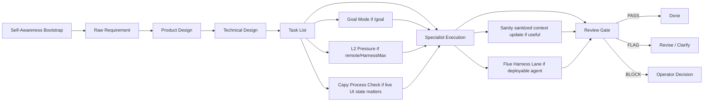

# Ultimate Workbench Synthesis

This document is the public strategy and architecture brief for the Multica
Ultimate Workbench. It intentionally avoids live workspace IDs, runtime IDs,
agent IDs, private machine names, screenshots, raw logs, and request payloads.

## Thesis

The workbench is a two-ring operating system for agentic software work:

- **Inner Ring**: intake, routing, supervision, synthesis, and final judgment.
- **Outer Ring**: implementation, research, design, QA, debugging, ops, VM work,
  and documentation.
- **Governance Layer**: Self-Awareness bootstrap, SDD, Goal Mode, review gates,
  flight recorder summaries, L2 Pressure, and explicit PASS / FLAG / BLOCK
  closeout.
- **Context Layer**: Sanity stores sanitized structured context for agents,
  runtimes, skills, evidence events, decisions, handoffs, and Capy process
  checks.
- **Distribution Layer**: agent-install syncs reviewed skills, MCP definitions,
  and AGENTS.md sections across coding agents.
- **Packaging Lanes**: Capy VM for disposable GUI/browser execution, Flue for
  deployable agent harnesses when a mature workflow should become HTTP, CI,
  Node, Cloudflare, or sandbox-backed code, and Runtime Hygiene for disk/swap/
  cache/session pressure management.

The goal is not "more agents." The goal is higher throughput without losing
traceability, role boundaries, or operator control.

## Operating Model

## Agent Roles

| Ring | Role | Responsibility |
| --- | --- | --- |
| Inner | Admin | Convert human intent into scoped issues and route work. |
| Inner | Supervisor | Review evidence, stop weak loops, and enforce PASS/FLAG/BLOCK. |
| Inner | Synthesizer | Keep durable architecture, decisions, and handoffs coherent. |
| Outer | Developer | Implement narrow changes with tests and verification. |
| Outer | Researcher | Gather source-grounded evidence and summarize constraints. |
| Outer | Designer / Docs | Improve product shape, README quality, and user-facing docs. |
| Outer | QA / Reviewer | Run independent checks and report residual risk. |
| Outer | Ops / VM | Handle runtimes, daemon health, VM/browser execution, and cleanup. |

## Self-Awareness

Self-Awareness is the preflight layer for non-trivial work. The owner posts
`SELF_AWARENESS_BOOTSTRAP` before SDD, Goal Mode, L2 Pressure, remote execution,
VM work, or repo-changing work. The block verifies runtime identity, role
boundary, repo anchor, tool and MCP envelope, memory sources, current-state
proof, risk boundary, route, success metric, operator-call conditions, and a
`READY` / `FLAG` / `BLOCK` verdict.

This keeps current evidence ahead of old memory. It also prevents a scheduled
job start, stale tool assumption, or wrong checkout from being mistaken for
progress.

## Goal Mode

`/goal` or `GOAL_MODE: yes` marks work that must persist until the stated
objective is verified, not merely until one local fix lands. The owner posts a
`GOAL_LOCK`, executes against closeout gates, investigates failed gates before
calling the operator, and reports `PASS`, `FLAG`, or `BLOCK` from evidence.

Goal Mode does not override approval, privacy, repo-anchor, destructive-action,
or Supervisor-review rules.

## L2 Pressure

`L2_PRESSURE: yes` or `RV_PRESSURE: required` means the owner must consult
Research Vault or the closest durable memory source before routing, reviewing, or
claiming a high-pressure autonomous path. The required output is
`RV_PRESSURE_CHECK`: vault source, bounded queries, relevant prior failures,
proven patterns, applied pressure, rejected pressure, next best action, and
`PASS` / `FLAG` / `BLOCK`.

Remote Hermes and remote VM tasks use Research Vault read-only first. The
approved remote MCP tool surface is `vault_status`, `vault_search`,
`vault_taxonomy`, and `vault_get`. Write, ingest, delete, maintenance, and raw
export are separate approval events.

## Flue Agent Harness Lane

Flue is the workbench's deployable agent harness outlet. Use it when a stable
workflow should become a reusable HTTP agent, CI reviewer, Node service,
Cloudflare Worker, or sandbox-backed coding/support agent.

The required artifact is `FLUE_AGENT_CONTRACT`: purpose, project directory,
workspace layout, agent file, deploy target, exact model ID, sandbox mode,
trigger, secrets policy, validation command, and public artifact policy.

Flue does not replace Multica routing, SDD planning, Goal Mode persistence, L2
Pressure, or Supervisor review. It packages proven behavior after the workbench
has already decided the workflow is stable enough to export.

## Capy Process Check Lane

Capy Process Check is the real-time Brave/Computer Use observation lane for
Capy task, thread, PR, and review panels. Its required output is
`CAPY_PROCESS_CHECK`: observed UI state, primary CLI/repo evidence, source of
truth, action taken, residual risk, and a PASS/FLAG/BLOCK verdict.

This lane is intentionally lower authority than GitHub CLI, git state, CI, and
review evidence. It helps agents see whether Capy is still running, ready, or
stale, but it cannot by itself justify merge, done, or release.

## Sanity Unified Context Lane

Sanity is the cross-CLI context registry. The first schema set is
`agentProfile`, `runtimeSurface`, `skillContract`, `evidenceEvent`,
`decisionRecord`, `handoff`, and `capyProcessCheck`.

Sanity stores sanitized summaries and pointers. It must not store secrets, raw
logs, OAuth material, raw transcripts, raw request payloads, or private
screenshots. Current repo and issue evidence still beat Sanity memory.

## Agent-Install Unifier Lane

agent-install is the config distribution lane for reviewed skills, MCP servers,
and AGENTS.md sections. It can keep Codex, Claude Code, Cursor, OpenCode, and
other coding agents aligned without hand-editing every native config format.

The required contract is `AGENT_INSTALL_SYNC_CONTRACT`: operation, source,
target agents, config scope, secrets policy, dry-run requirement, readback
requirement, and rollback plan.

## Runtime Hygiene Lane

Runtime Hygiene is the cleanup and closeout pressure layer for local and remote
runtimes. It keeps the workbench stable while high-throughput agents, VM runs,
Codex sessions, and Sanity sync loops are active.

The lane owns disk/swap/cache/session pressure checks, A-tier cache/log/temp
cleanup through `mo clean`, stale session closeout candidate reporting, and
Tier B/C residue review proposals. It does not hard-delete, close sessions
without evidence gates, or mutate daemons/Sanity/datasets without explicit
approval.

| Signal | Floor |
| --- | --- |
| Disk free | 80 Gi |
| Disk capacity flag | 85% |
| Swap used flag | 70% |
| Conversation warning | 25 |
| Conversation block | 50 |

The required output is `RUNTIME_HYGIENE_REPORT` with disk/swap/issue/session/
Sanity state and a PASS/FLAG/BLOCK verdict.

Sources: `docs/runtime-hygiene-lane.md`, `skills/workbench-runtime-hygiene/SKILL.md`,
`autopilots/runtime-hygiene-sweeper.md`, `issue-templates/runtime-hygiene-sweep.md`.

## Public Artifact Boundary

Tracked docs may include:

- role definitions
- issue templates
- SDD workflow contracts
- scripts with placeholder-driven configuration
- public run summaries that do not reveal private infrastructure

Tracked docs must not include:

- live workspace, runtime, project, agent, run, or comment IDs
- personal absolute paths
- remote machine names or direct IP addresses
- OAuth tokens, API keys, cookies, request payloads, or raw logs
- screenshots that reveal private UI state
- generated command transcripts with real IDs

## Capy Git Dialogue Lane

The `Capy Git Dialogue Lane` is the external Git/PR dialogue surface for
Captain Capy and similar coding agents. Durable loop signals belong in commit
subjects, PR titles/descriptions, and review comments because those artifacts
are diffable, reviewable, and tied to concrete repo state.

This lane does not change the architecture boundary: Multica remains the live
collaboration and runtime layer, while this repo and its PR history are durable
memory and review surfaces. PRs are proposed dialogue artifacts; merge or
acceptance stays with the human operator or Workbench Supervisor.

## Repo Anchor Rule

Agents should prefer the GitHub repository resource as the canonical source for
repo-backed tasks. Local `file://` checkouts are environment-specific fallback
evidence only and must be labeled as such.

Remote runtimes must not assume a laptop-local path exists. If a repo checkout
resolves to a local-only path, the correct result is `FLAG` or `BLOCK`, not a
silent switch to unrelated files.

## Evidence Model

Evidence should be compact and reviewable:

- command names and exit status
- changed file paths
- small derived summaries
- exact verdict labels
- residual risk
- commit subjects, PR titles/descriptions, and review comments when external
  Git dialogue is part of the loop
- Capy UI observation when paired with primary CLI or repo evidence
- Sanity records when they are sanitized summaries or pointers

Large artifacts belong in local temp storage or private issue comments, not in
public Git history.

## Current Direction

The next useful upgrades are:

- stronger public/private artifact split
- remote runtime handoff contracts
- automatic review sweep hardening
- remote HarnessMax evolve sweeper with L2 Pressure
- remote Research Vault MCP preflight and read-only contract
- Capy Process Check live-observation reports for Capy PR/thread panels
- Sanity context registry read/write discipline and MCP readback
- agent-install dry-run/readback sync for shared skill and MCP config
- Flue agent harness lane pilots for CI review and HTTP agent packaging
- live sync of `workbench-goal-mode` to the relevant Multica skills and agents
- VM lane smoke tests with temp-only evidence
- runtime-hygiene lane docs, skill, autopilot, and issue template synced to repo (DAS-410)
- README and docs polish that stays public-safe
