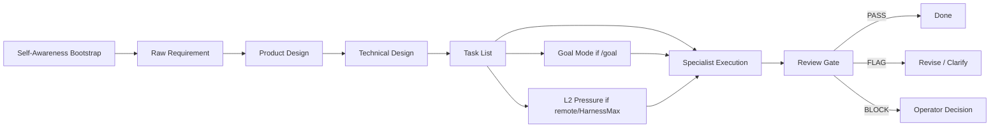

# Ultimate Workbench Synthesis

This document is the public strategy and architecture brief for the Multica
Ultimate Workbench. It intentionally avoids live workspace IDs, runtime IDs,
agent IDs, private machine names, screenshots, raw logs, and request payloads.

## Thesis

The workbench is a two-ring operating system for agentic software work:

- **Inner Ring**: intake, routing, supervision, synthesis, and final judgment.
- **Outer Ring**: implementation, research, design, QA, debugging, ops, VM work,
  and documentation.
- **Governance Layer**: Self-Awareness bootstrap, SDD, Goal Mode, review gates,
  flight recorder summaries, L2 Pressure, and explicit PASS / FLAG / BLOCK
  closeout.

The goal is not "more agents." The goal is higher throughput without losing
traceability, role boundaries, or operator control.

## Operating Model

## Agent Roles

| Ring | Role | Responsibility |
| --- | --- | --- |
| Inner | Admin | Convert human intent into scoped issues and route work. |
| Inner | Supervisor | Review evidence, stop weak loops, and enforce PASS/FLAG/BLOCK. |
| Inner | Synthesizer | Keep durable architecture, decisions, and handoffs coherent. |
| Outer | Developer | Implement narrow changes with tests and verification. |
| Outer | Researcher | Gather source-grounded evidence and summarize constraints. |
| Outer | Designer / Docs | Improve product shape, README quality, and user-facing docs. |
| Outer | QA / Reviewer | Run independent checks and report residual risk. |
| Outer | Ops / VM | Handle runtimes, daemon health, VM/browser execution, and cleanup. |

## Self-Awareness

Self-Awareness is the preflight layer for non-trivial work. The owner posts
`SELF_AWARENESS_BOOTSTRAP` before SDD, Goal Mode, L2 Pressure, remote execution,
VM work, or repo-changing work. The block verifies runtime identity, role
boundary, repo anchor, tool and MCP envelope, memory sources, current-state
proof, risk boundary, route, success metric, operator-call conditions, and a
`READY` / `FLAG` / `BLOCK` verdict.

This keeps current evidence ahead of old memory. It also prevents a scheduled
job start, stale tool assumption, or wrong checkout from being mistaken for
progress.

## Goal Mode

`/goal` or `GOAL_MODE: yes` marks work that must persist until the stated
objective is verified, not merely until one local fix lands. The owner posts a
`GOAL_LOCK`, executes against closeout gates, investigates failed gates before
calling the operator, and reports `PASS`, `FLAG`, or `BLOCK` from evidence.

Goal Mode does not override approval, privacy, repo-anchor, destructive-action,
or Supervisor-review rules.

## L2 Pressure

`L2_PRESSURE: yes` or `RV_PRESSURE: required` means the owner must consult
Research Vault or the closest durable memory source before routing, reviewing, or
claiming a high-pressure autonomous path. The required output is
`RV_PRESSURE_CHECK`: vault source, bounded queries, relevant prior failures,
proven patterns, applied pressure, rejected pressure, next best action, and
`PASS` / `FLAG` / `BLOCK`.

Remote Hermes and remote VM tasks use Research Vault read-only first. The
approved remote MCP tool surface is `vault_status`, `vault_search`,
`vault_taxonomy`, and `vault_get`. Write, ingest, delete, maintenance, and raw
export are separate approval events.

## Public Artifact Boundary

Tracked docs may include:

- role definitions
- issue templates
- SDD workflow contracts
- scripts with placeholder-driven configuration
- public run summaries that do not reveal private infrastructure

Tracked docs must not include:

- live workspace, runtime, project, agent, run, or comment IDs
- personal absolute paths
- remote machine names or direct IP addresses
- OAuth tokens, API keys, cookies, request payloads, or raw logs
- screenshots that reveal private UI state
- generated command transcripts with real IDs

## Capy Git Dialogue Lane

The `Capy Git Dialogue Lane` is the external Git/PR dialogue surface for
Captain Capy and similar coding agents. Durable loop signals belong in commit
subjects, PR titles/descriptions, and review comments because those artifacts
are diffable, reviewable, and tied to concrete repo state.

This lane does not change the architecture boundary: Multica remains the live
collaboration and runtime layer, while this repo and its PR history are durable
memory and review surfaces. PRs are proposed dialogue artifacts; merge or
acceptance stays with the human operator or Workbench Supervisor.

## Repo Anchor Rule

Agents should prefer the GitHub repository resource as the canonical source for
repo-backed tasks. Local `file://` checkouts are environment-specific fallback
evidence only and must be labeled as such.

Remote runtimes must not assume a laptop-local path exists. If a repo checkout
resolves to a local-only path, the correct result is `FLAG` or `BLOCK`, not a
silent switch to unrelated files.

## Evidence Model

Evidence should be compact and reviewable:

- command names and exit status
- changed file paths
- small derived summaries
- exact verdict labels
- residual risk
- commit subjects, PR titles/descriptions, and review comments when external
  Git dialogue is part of the loop

Large artifacts belong in local temp storage or private issue comments, not in
public Git history.

## Current Direction

The next useful upgrades are:

- stronger public/private artifact split
- remote runtime handoff contracts
- automatic review sweep hardening
- remote HarnessMax evolve sweeper with L2 Pressure
- remote Research Vault MCP preflight and read-only contract
- live sync of `workbench-goal-mode` to the relevant Multica skills and agents
- VM lane smoke tests with temp-only evidence
- README and docs polish that stays public-safe
