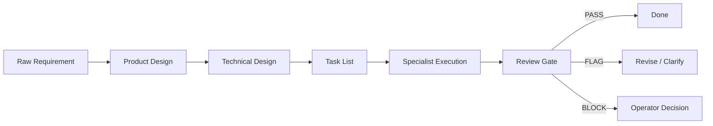

# Ultimate Workbench Synthesis

This document is the public strategy and architecture brief for the Multica
Ultimate Workbench. It intentionally avoids live workspace IDs, runtime IDs,
agent IDs, private machine names, screenshots, raw logs, and request payloads.

## Thesis

The workbench is a two-ring operating system for agentic software work:

- **Inner Ring**: intake, routing, supervision, synthesis, and final judgment.
- **Outer Ring**: implementation, research, design, QA, debugging, ops, VM work,
  and documentation.
- **Governance Layer**: SDD, review gates, flight recorder summaries, and
  explicit PASS / FLAG / BLOCK closeout.

The goal is not "more agents." The goal is higher throughput without losing
traceability, role boundaries, or operator control.

## Operating Model

## Agent Roles

| Ring | Role | Responsibility |
| --- | --- | --- |
| Inner | Admin | Convert human intent into scoped issues and route work. |
| Inner | Supervisor | Review evidence, stop weak loops, and enforce PASS/FLAG/BLOCK. |
| Inner | Synthesizer | Keep durable architecture, decisions, and handoffs coherent. |
| Outer | Developer | Implement narrow changes with tests and verification. |
| Outer | Researcher | Gather source-grounded evidence and summarize constraints. |
| Outer | Designer / Docs | Improve product shape, README quality, and user-facing docs. |
| Outer | QA / Reviewer | Run independent checks and report residual risk. |
| Outer | Ops / VM | Handle runtimes, daemon health, VM/browser execution, and cleanup. |

## Public Artifact Boundary

Tracked docs may include:

- role definitions
- issue templates
- SDD workflow contracts
- scripts with placeholder-driven configuration
- public run summaries that do not reveal private infrastructure

Tracked docs must not include:

- live workspace, runtime, project, agent, run, or comment IDs
- personal absolute paths
- remote machine names or direct IP addresses
- OAuth tokens, API keys, cookies, request payloads, or raw logs
- screenshots that reveal private UI state
- generated command transcripts with real IDs

## Repo Anchor Rule

Agents should prefer the GitHub repository resource as the canonical source for
repo-backed tasks. Local `file://` checkouts are environment-specific fallback
evidence only and must be labeled as such.

Remote runtimes must not assume a laptop-local path exists. If a repo checkout
resolves to a local-only path, the correct result is `FLAG` or `BLOCK`, not a
silent switch to unrelated files.

## Evidence Model

Evidence should be compact and reviewable:

- command names and exit status
- changed file paths
- small derived summaries
- exact verdict labels
- residual risk

Large artifacts belong in local temp storage or private issue comments, not in
public Git history.

## Current Direction

The next useful upgrades are:

- stronger public/private artifact split
- remote runtime handoff contracts
- automatic review sweep hardening
- VM lane smoke tests with temp-only evidence
- README and docs polish that stays public-safe
