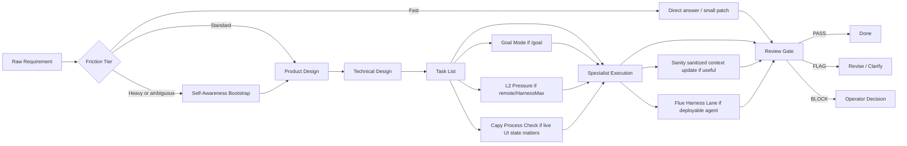

# Ultimate Workbench Synthesis

This document is the public strategy and architecture brief for the Multica
Ultimate Workbench. It intentionally avoids live workspace IDs, runtime IDs,
agent IDs, private machine names, screenshots, raw logs, and request payloads.

## Thesis

The workbench is a two-ring operating system for agentic software work:

- **Inner Ring**: intake, routing, supervision, synthesis, and final judgment.
- **Outer Ring**: implementation, research, design, QA, debugging, ops, VM work,
  and documentation.
- **Governance Layer**: Friction Tier Router, Self-Awareness bootstrap, SDD,
  Goal Mode, review gates, flight recorder summaries, L2 Pressure, Temporal
  Pincer closeout checks, and explicit PASS / FLAG / BLOCK closeout.
- **Context Layer**: Sanity stores sanitized structured context for agents,
  runtimes, skills, evidence events, decisions, handoffs, and Capy process
  checks. Wake reports restore session context by combining memory leads with
  live repo, issue, automation, knowledge, and runner verification before new
  work starts.
- **Windburn Cognitive Cache Direction**: a future `.learning` substrate turns
  perceptions, beliefs, failures, source truth, skills, and parking ideas into
  reviewed future-self context.
- **Distribution Layer**: agent-install syncs reviewed skills, MCP definitions,
  and AGENTS.md sections across coding agents.
- **Public Docs Sync Layer**: Claude Code authors public writeups first, then
  Hermes reviews every related public-facing surface through
  `workbench-hermes-docs-sync` before sync or publish.
- **Packaging Lanes**: Capy VM for disposable GUI/browser execution, Flue for
  deployable agent harnesses when a mature workflow should become HTTP, CI,
  Node, Cloudflare, or sandbox-backed code, and Runtime Hygiene for disk/swap/
  cache/session pressure management.

The goal is not "more agents." The goal is higher throughput without losing
traceability, role boundaries, or operator control.

The next memory-native direction is Windburn Cognitive Cache: preserve reality
feedback as typed memory so future runs change policy instead of repeating the
same failed action under new wording. See
[docs/windburn-cognitive-cache-direction.md](docs/windburn-cognitive-cache-direction.md)
and [docs/windburn-cognitive-cache-dispatch.md](docs/windburn-cognitive-cache-dispatch.md).

## Operating Model

## Agent Roles

| Ring | Role | Responsibility |
| --- | --- | --- |
| Inner | Admin | Convert human intent into scoped issues and route work. |
| Inner | Supervisor | Review evidence, stop weak loops, and enforce PASS/FLAG/BLOCK. |
| Inner | Synthesizer | Keep durable architecture, decisions, and handoffs coherent. |
| Outer | Developer | Implement narrow changes with tests and verification. |
| Outer | Researcher | Gather source-grounded evidence and summarize constraints. |
| Outer | Designer / Docs | Improve product shape, README quality, and user-facing docs. |
| Outer | QA / Reviewer | Run independent checks and report residual risk. |
| Outer | Ops / VM | Handle runtimes, daemon health, VM/browser execution, and cleanup. |

## Friction Tier Router

The workbench no longer sends every request through the same ceremony.
Workbench Admin classifies work at intake, and Workbench Supervisor enforces the
chosen tier during review.

| Tier | Use For | Required Gates |
| --- | --- | --- |
| Fast Path | Reading, summaries, copy edits, small README text, link cleanup, ACKs, empty scaffolds, lightweight classification, and work with no code, secrets, or runtime surface. | No bootstrap unless repo/runtime is ambiguous. No Temporal Pincer before send. No RV pressure check. No broad issue scan. Max 20 minutes. Close with Done Sentence / Changed / Verified / Next one action. |
| Standard Path | Ordinary code or docs patches, prototype demos, tests, PR prep, and visual page fixes. | Require issue anchor or explicit local task, evidence expectations before execution, touched-path verification, and closeout with Changed / Verified / Residual risk / Next one action. After 70% complete, add no new architecture names or integrations. |
| Heavy Path | Runtime, agent/autopilot, deploy, payment, OAuth, secrets, branch/merge, public proof, daemon/Desktop/core, and remote VM work. | Require Self-Awareness, Goal Lock when the objective spans turns, full evidence before PASS, Temporal Pincer for PASS/done/ready-to-merge, BLOCK for correctness risk, and human approval for permission/secret/payment/runtime mutation. |

Completion Cooling keeps late-stage work from expanding: at 75% only verify,
commit, or hand off; at 85% publish/reviewable means stop editing and collect
feedback; at 90% merged/accepted allows at most one `POST_MERGE_NOTE`; at 100%
no follow-up lane is created for 24 hours unless an external blocker appears.
New ideas during active work go to a one-line parking lot with Idea, Trigger,
and Earliest revisit only.

## Self-Awareness

Self-Awareness is the preflight layer for Heavy Path, ambiguous repo/runtime
ownership, and Standard Path work that depends on current runtime capability.
The owner posts `SELF_AWARENESS_BOOTSTRAP` to verify runtime identity, role
boundary, repo anchor, tool and MCP envelope, memory sources, current-state
proof, risk boundary, route, success metric, operator-call conditions, and a
`READY` / `FLAG` / `BLOCK` verdict.

This keeps current evidence ahead of old memory. It also prevents a scheduled
job start, stale tool assumption, or wrong checkout from being mistaken for
progress.

## Goal Mode

Goal Mode comes in two versions:

### v1 — Single-Agent Persistence Wrapper

`/goal` or `GOAL_MODE: yes` marks work that must persist until the stated
objective is verified, not merely until one local fix lands. The owner posts a
`GOAL_LOCK`, executes against closeout gates, investigates failed gates before
calling the operator, and reports `PASS`, `FLAG`, or `BLOCK` from evidence.

Goal Mode does not override approval, privacy, repo-anchor, destructive-action,
or Supervisor-review rules.

### v2 — Two-Layer Autonomous Conductor

`GOAL_MODE_V2: yes` enables the persistent conductor: a design/decision layer
that produces decision packets, and a dispatch/operations layer that converts
them into bounded Multica issues with dedupe, cooldown, max-active, and archive
controls.

The state machine runs `GOAL_CAPTURED → DESIGNING → DECISION_PACKET →
DISPATCHING → OBSERVING → REVIEWING → BLOCKER_CLASSIFIED →
LEARNING/ARCHIVING → NEXT_GOAL_OR_DONE`. The conductor stops only at real
operator-call or external-platform blockers.

Key contracts: `DECISION_PACKET` for scoped routing, `GOAL_MODE_V2_CLOSEOUT`
for evidence-backed completion. Noise is prevented by dedupe keys, cooldown
timers, max-active caps, and cancel-on-sight for duplicate issues.

Use v2 when the objective spans multiple agents and evidence cycles. Use v1 for
simple single-agent persistence. See
`skills/workbench-goal-mode-v2/SKILL.md`,
`issue-templates/goal-mode-v2.md`, and
`autopilots/goal-conductor.md`.

## L2 Pressure

`L2_PRESSURE: yes` or `RV_PRESSURE: required` means the owner must consult
Research Vault or the closest durable memory source before routing, reviewing, or
claiming a high-pressure autonomous path. The required output is
`RV_PRESSURE_CHECK`: vault source, bounded queries, relevant prior failures,
proven patterns, applied pressure, rejected pressure, next best action, and
`PASS` / `FLAG` / `BLOCK`.

Remote Hermes and remote VM tasks use Research Vault read-only first. The
approved remote MCP tool surface is `vault_status`, `vault_search`,
`vault_taxonomy`, and `vault_get`. Write, ingest, delete, maintenance, and raw
export are separate approval events.

## Flue Agent Harness Lane

Flue is the workbench's deployable agent harness outlet. Use it when a stable
workflow should become a reusable HTTP agent, CI reviewer, Node service,
Cloudflare Worker, or sandbox-backed coding/support agent.

The required artifact is `FLUE_AGENT_CONTRACT`: purpose, project directory,
workspace layout, agent file, deploy target, exact model ID, sandbox mode,
trigger, secrets policy, validation command, and public artifact policy.

Flue does not replace Multica routing, SDD planning, Goal Mode persistence, L2
Pressure, or Supervisor review. It packages proven behavior after the workbench
has already decided the workflow is stable enough to export.

## Capy Process Check Lane

Capy Process Check is the real-time Brave/Computer Use observation lane for
Capy task, thread, PR, and review panels. Its required output is
`CAPY_PROCESS_CHECK`: observed UI state, primary CLI/repo evidence, source of
truth, action taken, residual risk, and a PASS/FLAG/BLOCK verdict.

This lane is intentionally lower authority than GitHub CLI, git state, CI, and
review evidence. It helps agents see whether Capy is still running, ready, or
stale, but it cannot by itself justify merge, done, or release.

## Sanity Unified Context Lane

Sanity is the cross-CLI context registry. The first schema set is
`agentProfile`, `runtimeSurface`, `skillContract`, `evidenceEvent`,
`decisionRecord`, `handoff`, and `capyProcessCheck`.

Sanity stores sanitized summaries and pointers. It must not store secrets, raw
logs, OAuth material, raw transcripts, raw request payloads, or private
screenshots. Current repo and issue evidence still beat Sanity memory.

## Agent-Install Unifier Lane

agent-install is the config distribution lane for reviewed skills, MCP servers,
and AGENTS.md sections. It can keep Codex, Claude Code, Cursor, OpenCode, and
other coding agents aligned without hand-editing every native config format.

The required contract is `AGENT_INSTALL_SYNC_CONTRACT`: operation, source,
target agents, config scope, secrets policy, dry-run requirement, readback
requirement, and rollback plan.

## Runtime Hygiene Lane

Runtime Hygiene is the cleanup and closeout pressure layer for local and remote
runtimes. It keeps the workbench stable while high-throughput agents, VM runs,
Codex sessions, and Sanity sync loops are active.

The lane owns disk/swap/cache/session pressure checks, A-tier cache/log/temp
cleanup through `mo clean`, completed-run Codex plugin sync cache cleanup
through `scripts/multica-codex-cache-janitor.sh`, stale session closeout
candidate reporting, and Tier B/C residue review proposals. It does not
hard-delete unrelated data, close sessions without evidence gates, or mutate
daemons/Sanity/datasets without explicit approval.

| Signal | Floor |
| --- | --- |
| Disk free | 80 Gi |
| Disk capacity flag | 85% |
| Swap used flag | 70% |
| Conversation warning | 25 |
| Conversation block | 50 |

The required output is `RUNTIME_HYGIENE_REPORT` with disk/swap/issue/session/
Sanity state and a PASS/FLAG/BLOCK verdict.

Codex Workbench runs should also use a lean per-run profile that omits plugin
marketplace tables unless the issue explicitly needs them. See
`docs/codex-workbench-runtime-profile.md` and
`config/multica-workbench-codex-profile.example.toml`.

Sources: `docs/runtime-hygiene-lane.md`, `docs/codex-workbench-runtime-profile.md`,
`skills/workbench-runtime-hygiene/SKILL.md`, `autopilots/runtime-hygiene-sweeper.md`,
`issue-templates/runtime-hygiene-sweep.md`.

## Public Artifact Boundary

Tracked docs may include:

- role definitions
- issue templates
- SDD workflow contracts
- scripts with placeholder-driven configuration
- public run summaries that do not reveal private infrastructure

Tracked docs must not include:

- live workspace, runtime, project, agent, run, or comment IDs
- personal absolute paths
- remote machine names or direct IP addresses
- OAuth tokens, API keys, cookies, request payloads, or raw logs
- screenshots that reveal private UI state
- generated command transcripts with real IDs

## Capy Git Dialogue Lane

The `Capy Git Dialogue Lane` is the external Git/PR dialogue surface for
Captain Capy and similar coding agents. Durable loop signals belong in commit
subjects, PR titles/descriptions, review comments, and bounded responder replies
because those artifacts are diffable, reviewable, and tied to concrete repo
state.

This lane now includes a whole-access GitHub webhook responder. It must read
the payload `owner/repo`, event, action, branch/ref, and issue/PR/comment/check
state before acting, then follow repo-local instructions when present instead of
assuming the workbench repo. The responder should avoid spam, post at most one
concise route/review note for eligible non-draft PR lifecycle events, limit
check/workflow follow-up to threads where Capy is already involved or waiting,
and never merge, auto-merge, or mutate live runtime/config state without
explicit approval.

This lane does not change the architecture boundary: Multica remains the live
collaboration and runtime layer, while this repo and its PR history are durable
memory and review surfaces. PRs are proposed dialogue artifacts; merge or
acceptance stays with the human operator or Workbench Supervisor.

## Project Windburn Scaffold Lane

For new webpage, subpage, landing-page, and microsite work, use
`Fearvox/project-windburn` as the default repo anchor only when no target repo
is named in the request, attached to the issue or project, or otherwise
established by primary repo evidence. Current repo evidence is intentionally
treated as scaffold-only: do not assume an app root, shared packages, route
tree, build system, or deployment wiring until the repo itself proves them.

Expected shape: keep the root for index/routing/workflow docs, create each page
as its own project directly under the checkout as
`<project-windburn checkout>/<page-name>/`, do not create a nested
`<project-windburn checkout>/project-windburn/<page-name>/` directory unless
the human explicitly asks for it, and keep cross-page sharing explicit and
reviewed. See
[docs/project-windburn-scaffold-lane.md](docs/project-windburn-scaffold-lane.md).

## Repo Anchor Rule

Agents should prefer the GitHub repository resource as the canonical source for
repo-backed tasks. Local `file://` checkouts are environment-specific fallback
evidence only and must be labeled as such.

Remote runtimes must not assume a laptop-local path exists. If a repo checkout
resolves to a local-only path, the correct result is `FLAG` or `BLOCK`, not a
silent switch to unrelated files.

## Evidence Model

Evidence should be compact and reviewable:

- command names and exit status
- changed file paths
- small derived summaries
- exact verdict labels
- residual risk
- commit subjects, PR titles/descriptions, and review comments when external
  Git dialogue is part of the loop
- Capy UI observation when paired with primary CLI or repo evidence
- Sanity records when they are sanitized summaries or pointers

Large artifacts belong in local temp storage or private issue comments, not in
public Git history.

## Current Direction

The next useful upgrades are:

- stronger public/private artifact split
- remote runtime handoff contracts
- automatic review sweep hardening
- remote HarnessMax evolve sweeper with L2 Pressure
- remote Research Vault MCP preflight and read-only contract
- Capy Process Check live-observation reports for Capy PR/thread panels
- Sanity context registry read/write discipline and MCP readback
- agent-install dry-run/readback sync for shared skill and MCP config
- Flue agent harness lane pilots for CI review and HTTP agent packaging
- live sync of `workbench-goal-mode` and `workbench-goal-mode-v2` to the relevant Multica skills and agents
- Goal Mode v2 conductor autopilot deployment after dogfood pass (DAS-768)
- VM lane smoke tests with temp-only evidence
- runtime-hygiene lane docs, skill, autopilot, and issue template synced to repo (DAS-410)
- README and docs polish that stays public-safe
