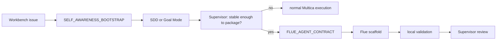

# Flue Agent Harness Lane

Flue is the deployable agent harness lane for the Ultimate Workbench. It turns a
mature workbench workflow into a reusable agent that can run through HTTP,
Node.js, Cloudflare Workers, CI, or a sandbox-backed execution cell.

This lane does not replace Multica, SDD, Goal Mode, L2 Pressure, Supervisor
review, or the two-ring model. It is an output path for agent workflows that have
become stable enough to package.

## Role In The Workbench

| Layer | Owns | Boundary |
| --- | --- | --- |
| Multica | live agents, issues, comments, runtimes, skills, autopilots | source of live routing and review |
| Workbench repo | durable roles, templates, skills, decisions, safety rules | source of operating memory |
| Flue lane | deployable agent harnesses and sandbox sessions | packaging outlet for mature workflows |

Use Flue when the work should become a callable agent. Keep ordinary routing,
review, and status transitions in Multica.

## When To Use It

Use `flue-agent-harness` when the task needs one of these:

- a reusable HTTP agent endpoint;
- a CI triage or review agent;
- a Node.js or Cloudflare-deployed agent;
- a sandbox-backed coding or support agent;
- a stable skill or role pack that should run outside a live Multica issue;
- an MCP-backed agent whose trusted code owns tool connection and secrets.

Do not use this lane for ordinary markdown updates, one-off repo edits, live
Multica routing, Supervisor review, agent prompt maintenance, or private runtime
mutation.

## Source References

The lane follows the public Flue onboarding source:

- `https://flueframework.com/start.md`
- `https://raw.githubusercontent.com/withastro/flue/refs/heads/main/README.md`
- `https://flueframework.com/models.json`

Flue describes the core shape as `Agent = Model + Harness`. In workbench terms,
the harness is the deployable wrapper around a proven workflow; the workflow's
governance remains outside the harness.

## Flue Agent Contract

Every Flue scaffold issue must include:

```yaml
FLUE_AGENT_CONTRACT:
  purpose: "<what the agent should do>"
  project_directory: "<absolute or repo-relative path>"
  workspace_layout: "root | .flue"
  agent_file: "./agents/<name>.ts | ./.flue/agents/<name>.ts"
  deploy_target: "node | cloudflare | github-actions | gitlab-ci | other-node-baseline"
  model_id: "anthropic/claude-sonnet-4-6 | anthropic/claude-opus-4-7 | openai/gpt-5.5 | openrouter/moonshotai/kimi-k2.6 | <models.json id>"
  sandbox_mode: "virtual | local | cloudflare-r2 | container | external"
  trigger: "webhook | cli | ci"
  secrets_policy: "none | env-only | host-command-env"
  validation_command: "<exact command>"
  public_artifact_policy: "summaries-only"
```

If the target directory is new or empty, use the root layout:

```text
agents/<name>.ts
roles/<role>.md
```

If the target directory already has files, use the `.flue` layout:

```text
.flue/agents/<name>.ts
.flue/roles/<role>.md
```

For this repository itself, the inferred layout is `.flue` because the repo is
non-empty. Do not scaffold a live Flue app in this repo unless a separate issue
explicitly asks for it.

## Deployment Targets

| Target | Use For | Local Verification |
| --- | --- | --- |
| `node` | local service, portable server, Vercel/Fly/Render baseline | `flue dev --target node` or `flue build --target node` |
| `cloudflare` | Workers, Durable Objects, R2-backed knowledge files | `flue dev --target cloudflare` |
| `github-actions` | PR, issue, or scheduled CI agent | `flue run <agent> --target node` from CI |
| `gitlab-ci` | GitLab issue/MR pipelines | `flue run <agent> --target node` from CI |
| `other-node-baseline` | hosts without a dedicated guide | follow Node target first |

`flue run --target cloudflare` is not a valid local exercise path. Use
`flue dev --target cloudflare` for local Cloudflare testing, or build and call a
deployed endpoint after deployment.

## Model Rules

Use one of the published model identifiers unless a task names another exact ID:

- `anthropic/claude-sonnet-4-6`
- `anthropic/claude-opus-4-7`
- `openai/gpt-5.5`
- `openrouter/moonshotai/kimi-k2.6`

If a requested model is not in the public model list, stop with `BLOCK` and ask
for a substitute. Do not silently rewrite the model.

## Sandbox And MCP Rules

| Mode | Use For | Boundary |
| --- | --- | --- |
| `virtual` | fast webhook agents and support-style agents | lowest startup cost |
| `local` | CI agents on a checked-out repo | host commands must be explicitly granted |
| `cloudflare-r2` | knowledge-base support agents | bucket binding stays in environment |
| `container` | coding agents that need full Linux/browser/tooling | cleanup and artifact policy required |
| `external` | Daytona or other connector-backed cells | connector secrets stay in env |

Remote MCP tools may be connected only from trusted code. Secrets belong in
environment variables or host command definitions, never in prompts, durable
docs, raw logs, or committed examples.

## Workflow



## First Pilot Candidates

Good first pilots:

- CI review/triage agent using `sandbox: "local"`;
- Research Vault read-only reviewer using remote MCP tools from trusted code;
- support-style documentation assistant with a mounted knowledge base;
- repo hygiene agent that creates a compact PASS/FLAG/BLOCK report.

Avoid using the first pilot for broad autonomous mutation. Package one narrow
workflow, prove it, then widen.

## Review Contract

Closeout must report:

- `FLUE_AGENT_CONTRACT` as implemented;
- files created or modified;
- exact model ID;
- exact deploy target;
- exact validation command and result;
- whether secrets were required and where they are expected;
- whether the output is a starter scaffold or production-ready harness;
- `VERDICT: PASS | FLAG | BLOCK`.

`PASS` requires a runnable or build-verified starter and no public safety leak.
`FLAG` means the scaffold is correct but still needs external secrets, deploy
credentials, or host setup. `BLOCK` means the contract is missing, the model is
invalid, or the target cannot be safely inferred.
