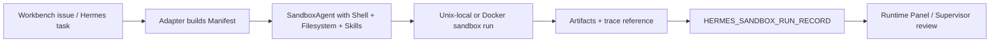

# Hermes OpenAI Sandbox Adapter Lane

Generated: `2026-05-05`

## Purpose

This lane tests OpenAI Agents SDK sandbox support as an execution backend for a
bounded Hermes worker run. It is an adapter spike, not a Hermes rewrite and not
a replacement for the Workbench Runtime Panel.

The split is:

| Layer | Owns | Boundary |
| --- | --- | --- |
| OpenAI Agents SDK | single-agent harness, sandbox session, manifest, capabilities, tracing | execution backend for one bounded worker |
| Hermes | research/docs/memory worker behavior and upstream runtime conventions | caller or comparison target, not overwritten |
| Workbench Runtime Panel | fleet topology, provider registry, permissions, live health, finalization drift | control plane and operator view |

OpenAI handles how one agent run executes in an isolated workspace. Workbench
still handles which runtimes exist, who may mutate what, which run is trusted,
and how evidence becomes reviewable.

## Source Baseline

Use official OpenAI docs as the live source before implementation:

- <https://developers.openai.com/api/docs/guides/agents/sandboxes>
- <https://developers.openai.com/api/docs/guides/tools#usage-in-the-agents-sdk>

Current important constraint: sandbox agents are documented for the Python
Agents SDK. Treat TypeScript or non-SDK wrappers as future work unless official
docs have changed.

## When To Use It

Use this lane when a Hermes-style worker needs:

- an isolated repo/filesystem workspace;
- shell and file editing with `apply_patch`-style behavior;
- skills or AGENTS.md materialized into the run workspace;
- generated artifacts that need inspection after the run;
- resumable sandbox session state or snapshots;
- trace evidence that can be linked from a fleet/runtime panel.

Do not use this lane for simple chat answers, ordinary markdown edits, live
Multica runtime mutation, hosted-provider shopping, or broad memory-system
changes.

## Minimum Adapter Contract

Every spike issue must include:

```yaml
HERMES_OPENAI_SANDBOX_ADAPTER:
  purpose: "<one bounded worker task>"
  hermes_surface: "research | docs-sync | code-review | repo-worker | other"
  provider: "unix-local | docker"
  model_id: "gpt-5.5 | <official OpenAI model id>"
  manifest_entries:
    repo: "<workspace-relative repo path or GitRepo source>"
    task_file: "<workspace-relative task spec>"
    output_dir: "<workspace-relative output directory>"
    instructions_files: ["AGENTS.md"]
    skills_source: "<none | LocalDir | LocalDirLazySkillSource | GitRepo>"
  capabilities: ["Shell", "Filesystem", "Skills"]
  sdk_memory_policy: "disabled"
  secrets_policy: "none | provider-injected-env-only"
  trace_policy: "record workflow name and trace reference only"
  artifact_policy: "summaries-and-output-manifest-only"
  finalization_mapping: "produce HERMES_SANDBOX_RUN_RECORD"
  validation_command: "<exact command>"
```

Default rule: `sdk_memory_policy: disabled`. Windburn `.learning`,
ActiveMemoryPacket, and Workbench decisions remain the authority surfaces for
behavior-changing memory until a separate reviewed issue defines a safe bridge.

## Adapter Shape



The adapter should stage a fresh workspace using relative manifest paths:

- `repo/` for the target checkout or fixture;
- `task/task.md` for the bounded task;
- `instructions/AGENTS.md` or repo-local `AGENTS.md`;
- `skills/` only through the SDK `Skills` capability, not prompt-pasted files;
- `output/` for reports, patches, logs, and manifests.

## Run Record

The adapter output must be public-safe and grep-friendly:

```yaml
HERMES_SANDBOX_RUN_RECORD:
  hermes_run_id: "<if applicable>"
  workbench_issue_id: "<if applicable>"
  sdk_workflow_name: "<name>"
  sandbox_provider: "unix-local | docker"
  sandbox_session_ref: "<redacted pointer or none>"
  snapshot_ref: "<redacted pointer or none>"
  trace_ref: "<redacted URL/id or none>"
  artifact_manifest: ["output/report.md", "output/patch.diff"]
  finalization_state: "completed | failed | needs_reconcile"
  telemetry:
    input_tokens: "<number | unavailable>"
    cache_read_tokens: "<number | unavailable>"
    output_tokens: "<number | unavailable>"
    wall_clock_ms: "<number | unavailable>"
    tool_call_count: "<number | unavailable>"
  residual_risk: "<one sentence>"
  VERDICT: "PASS | FLAG | BLOCK"
```

Missing token, credit, or wall-clock fields block efficiency claims but do not
automatically block the adapter smoke.

## Runtime Panel Contract

Do not build a new dashboard first. The smallest Runtime Panel extension is a
schema read path:

```yaml
runtime_backend:
  execution_provider: "openai-agents-sandbox"
  provider: "unix-local | docker | hosted-later"
  trace_ref: "<redacted pointer>"
  sandbox_resumable: true
  artifact_manifest: ["..."]
  permission_source: "workbench-registry-card"
```

The Runtime Panel should display the adapter as one backend among many. It must
not infer permission from the SDK trace or sandbox session.

## Deferred Work

Leave these to Workbench follow-up issues:

- hosted providers such as Vercel, Cloudflare, E2B, Modal, Daytona, or Blaxel;
- SDK `Memory()` integration;
- automatic trace ingestion into the Runtime Panel UI;
- Hermes runtime replacement;
- production secrets handling;
- cross-provider benchmark claims.

## PASS Criteria

- Official OpenAI docs were checked during implementation.
- The spike uses `unix-local` or Docker first.
- The adapter can produce one `HERMES_SANDBOX_RUN_RECORD`.
- No secrets, raw traces, raw transcripts, private URLs, or local absolute paths
  are committed.
- SDK memory is disabled unless a separate reviewed issue explicitly changes
  that policy.
- Runtime Panel changes, if any, are schema/read-only first.
