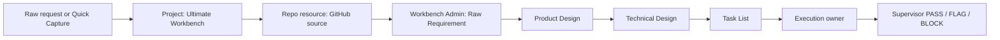

# Multica 0.2.21 Workflow Upgrade

This document records the workbench rules enabled by Multica 0.2.21. It is the operating bridge between new Multica product surface area and this repo's existing SDD, review, skill, and VM-lane protocols.

Source: [Multica changelog](https://multica.ai/changelog).

## Live Project

| Field | Value |
| --- | --- |
| Project | `Ultimate Workbench` |
| Project ID | private deployment detail |
| Status | `in_progress` |
| Lead | `Workbench Admin` |
| GitHub repo resource | `https://github.com/Fearvox/multica-ultimate-workbench` |
| Resource ID | private deployment detail |
| Evidence | private temp evidence, not tracked in Git |

## Intake Flow

Use Quick Capture or a human-created issue for fuzzy input. Use the Project
binding to anchor the correct repository before any agent claims file evidence.
Use the Friction Tier Router first, then apply SDD comments when the selected
tier calls for them.



## Project-Bound Repo Rule

When a Multica issue belongs to this workbench, the issue should attach or name the `Ultimate Workbench` project. Agents should prefer the project-bound GitHub repo resource before guessing a checkout path.

Primary repo anchor:

```text
Ultimate Workbench project -> https://github.com/Fearvox/multica-ultimate-workbench
```

If repo files are needed inside a laptop-local runtime workdir and the project-bound resource is unavailable, use the local path only as an explicit fallback:

```bash
multica repo checkout file://<LOCAL_WORKBENCH_REPO>
```

Then label the evidence as local fallback and verify the branch or commit before citing file evidence.

Remote runtimes such as `<REMOTE_MULTICA_DEVICE>` must not rely on that `file://` path. If `multica repo checkout https://github.com/Fearvox/multica-ultimate-workbench` fails because workspace repo metadata still points at the laptop path, the agent should report `FLAG` or `BLOCK` and request a repo-anchor fix rather than silently switching to unrelated files.

## Fresh Rerun Rule

Use a fresh rerun when a task shows signs of stale context, poisoned resume state, repeated tool failure, or unclear ownership. A rerun is preferred over extending a polluted run when:

- the agent read the wrong repo or branch;
- the run inherited stale issue state;
- tool auth or runtime state changed during execution;
- an execution reached evidence-ready state but did not publish a comment;
- a Supervisor retry should review current artifacts rather than old context.

The rerun must cite the old run ID as context, then start from the latest `HANDOFF_SUMMARY` and `SCOPED_EVIDENCE`.

## Mermaid Rule

Use Mermaid diagrams for routing, ownership, state machines, and execution lanes when text would be ambiguous. Keep diagrams small enough to fit in one issue comment.

Preferred diagram types:

- `flowchart` for SDD and issue routing.
- `sequenceDiagram` for agent handoffs.
- `stateDiagram-v2` for review state.

## Runtime Config Rule

Use Multica agent config for runtime-specific behavior before duplicating it in prompts.

| Need | Preferred surface |
| --- | --- |
| Model selection | `multica agent update <id> --model <model>` |
| Runtime secrets | `--custom-env-file` or `--custom-env-stdin` |
| Non-secret CLI flags | `--custom-args` only when `--model` is not enough |
| Approval policy | Runtime-native config, not workbench prose |

Never put secret values in repo docs, issue comments, shell history, or command transcripts.

## Create-Issue-By-Agent Rule

If an agent creates or drafts an issue from a raw request, the first durable comment must preserve the literal request and declare:

```text
INTAKE_SOURCE:
PROJECT:
REPO_RESOURCE:
URL_CONTEXT:
HANDOFF_SUMMARY:
SCOPED_EVIDENCE:
ANTI_OVER_READ:
```

If URL enrichment was used, include the URL and the small extracted fact set. Do not paste full pages or raw private content.

## Review Gate

Supervisor should check:

1. The issue is attached to or names the correct Project.
2. Repo evidence came from the project-bound repo or an explicit checkout.
3. SDD comments include compact handoff fields.
4. Reruns cite the stale/failed prior run and start fresh.
5. Runtime model/env changes are recorded with IDs and verification evidence.

Final review still ends with `PASS`, `FLAG`, or `BLOCK`.
