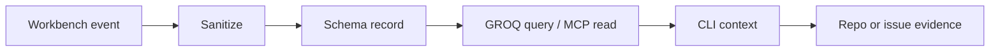

# Sanity Unified Context Lane

The Sanity Unified Context Lane is a structured, sanitized context registry for
the workbench. It gives Codex, Claude Code, Hermes, Capy, and other CLIs a
shared content model for durable context without stuffing every runtime prompt
with the same history.

Sanity stores indexes, summaries, contracts, and handoffs. It does not store raw
telemetry, secrets, raw transcripts, private screenshots, OAuth material, or
request payloads.

## Role In The Workbench

| Layer | Owns | Boundary |
| --- | --- | --- |
| Multica | live issues, runs, assignments, comments | live coordination |
| Git repo | reviewed source, docs, skills, templates | durable public memory |
| Sanity | structured sanitized context records | cross-CLI query layer |
| Research Vault | deeper local/private knowledge | read-only pressure source |

## First Schema Set

| Type | Purpose |
| --- | --- |
| `agentProfile` | stable role, runtime, ownership, and boundaries |
| `runtimeSurface` | CLI, desktop, VM, remote cell, or browser capability state |
| `skillContract` | source-controlled skill metadata and attachment intent |
| `evidenceEvent` | compact proof event with command/file/verdict references |
| `decisionRecord` | sanitized decision and rationale |
| `handoff` | compact cross-runtime handoff |
| `capyProcessCheck` | sanitized Capy UI observation with primary evidence pointers |

## Data Policy

Allowed:

- sanitized titles, roles, statuses, and summaries;
- public repo paths;
- public PR numbers and commit subjects;
- exact verdict labels;
- command names and exit status;
- pointers to private evidence without copying the evidence.

Not allowed:

- OAuth material, API keys, cookies, tokens, passwords;
- raw request payloads or full run transcripts;
- private absolute paths unless explicitly marked local-only and sanitized;
- screenshots or browser traces;
- live workspace, runtime, project, agent, run, or comment IDs in public docs.

## Workflow

Sanity can accelerate discovery, but it must not become an unreviewed memory
override. Current repo evidence, issue evidence, and review gates still win.

