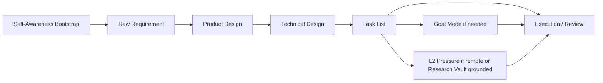

# Self-Awareness Infra Layer

The Self-Awareness Infra Layer is the first boot step for non-trivial workbench
runs. It makes an agent verify what it is, what it can actually use right now,
which repo or issue is authoritative, which memory sources are current, and what
counts as completion before it starts routing or implementation.

This is not a motivational prompt. It is a small capability and risk audit that
prevents stale context, tool hallucination, scheduler-start claims, and
wrong-repo work.

## Position In The Workbench



Self-Awareness runs before SDD, Goal Mode, L2 Pressure, VM routing, or remote
execution. It does not replace those layers; it decides which one should run
next and what proof they must carry.

## Required Bootstrap

Agents post or maintain this block before routing, implementation, or review:

```text
SELF_AWARENESS_BOOTSTRAP
runtime_identity:
role_boundary:
repo_anchor:
tool_envelope:
mcp_envelope:
memory_sources_checked:
current_state_proof:
risk_envelope:
routing_decision:
success_metric:
operator_call_conditions:
verdict: READY | FLAG | BLOCK
```

## What The Fields Mean

| Field | Purpose |
| --- | --- |
| `runtime_identity` | Name the runtime family and execution cell without exposing private IDs, tokens, direct IPs, or raw environment output. |
| `role_boundary` | State what this agent owns and what it must not take over. |
| `repo_anchor` | Identify the project-bound repo/resource, branch, and whether any local path is authoritative or fallback-only. |
| `tool_envelope` | List the relevant tools actually available or checked in this run. |
| `mcp_envelope` | List the relevant MCP/connectors visible in this runtime; mark missing tools explicitly. |
| `memory_sources_checked` | Separate current repo or issue evidence from advisory memory. |
| `current_state_proof` | Include small proof such as issue JSON, `git status`, run status, docs read, or command exit status. |
| `risk_envelope` | Name secrets, public/private boundary, destructive actions, runtime mutation, cost, and release risk. |
| `routing_decision` | Choose inline execution, SDD, Multica child issues, remote runtime, VM lane, L2 Pressure, or Supervisor review. |
| `success_metric` | State the artifact that counts: merged PR, verified run, build/test pass, shipped doc, closed issue, or proven blocker. |
| `operator_call_conditions` | List the few conditions that justify stopping for the human. |

## Verdicts

`READY` means the agent has enough live evidence, tool visibility, repo anchor,
risk boundary, and success metric to proceed.

`FLAG` means the agent can proceed with a bounded caveat: a non-critical MCP is
missing, memory is advisory only, repo checkout is usable but not ideal, or one
verification gate must be deferred with rationale.

`BLOCK` means work must not proceed until a real external blocker is fixed:
missing credentials, invalid repo anchor for repo-changing work, destructive
action requiring approval, or an unavailable required runtime/tool.

## Routing Outcomes

Use the bootstrap to route work instead of letting one agent become the
bottleneck.

| Situation | Route |
| --- | --- |
| Small local patch with clear proof | Execute inline and report evidence. |
| Product or architecture ambiguity | Start SDD. |
| `/goal`, `GOAL_MODE: yes`, or persistence request | Run Goal Mode after bootstrap. |
| Remote Hermes, VM, HarnessMax, or Research Vault grounded work | Run L2 Pressure after bootstrap. |
| GUI, browser, sandbox, screenshot, or disposable desktop state | Use the VM lane with a lease and artifact-backed closeout. |
| Work is already implemented but lacks review | Route to Supervisor or QA review. |
| Two or more independent work slices exist | Create or use Multica child issues. |

## Safety Boundary

The layer is public-safe by design.

- Do not paste raw environment dumps, tokens, cookies, request payloads, or full
  logs into durable docs.
- Do not include live workspace, runtime, agent, issue, run, or comment IDs in
  public repository files.
- Do not claim an MCP or tool exists because it was available in another
  runtime.
- Do not treat historical memory as proof of current branch, PR, CI, issue, or
  run state.
- Do not mutate daemons, Desktop UI, preserved agents, or runtime bindings unless
  the task explicitly asks for that mutation and the risk is reviewed.

## Closeout

When a task used this layer, close with a compact summary of whether the
bootstrap changed the route or risk posture:

```text
SELF_AWARENESS_CLOSEOUT
bootstrap_verdict:
routing_used:
capability_gap_found:
artifact_or_blocker:
residual_risk:
next_slice_started:
```

The strongest closeout is not a longer narrative. It is a shipped artifact, real
verification, merged PR, closed issue, or a precise blocker with the smallest
operator action needed.
