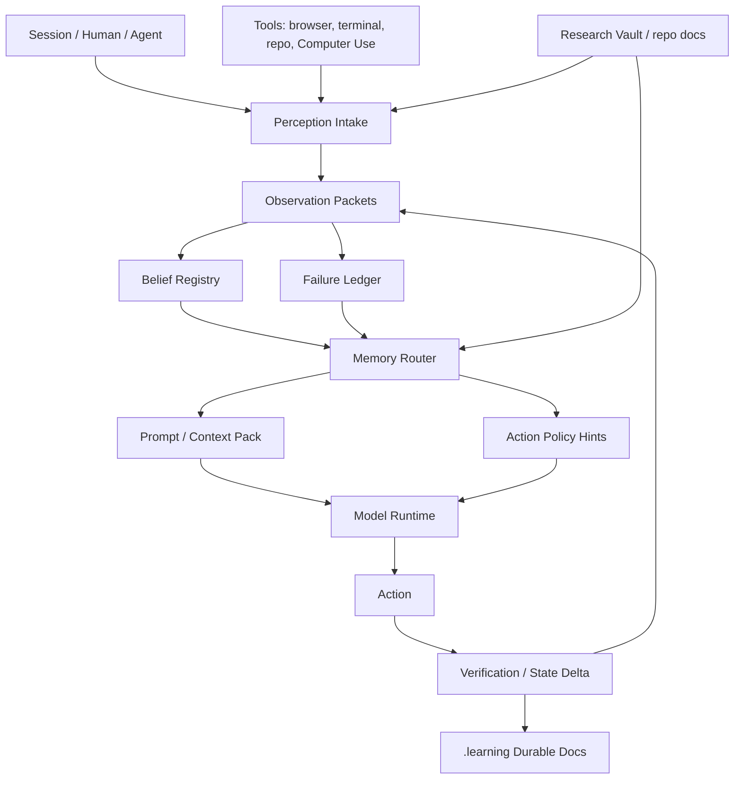

# Windburn Cognitive Cache Direction

Date: 2026-05-03

This is the public-safe direction record for Windburn's memory-native agent
substrate. It records the original design intent without raw transcripts,
private runtime IDs, secrets, screenshots, or live workspace payloads.

## One-Line Thesis

Windburn should not start as a new base model. It should start as a
memory-native agent substrate that turns human-agent interaction, tool
feedback, failures, repo state, and Research Vault evidence into durable
future-self cognition.

## Core Claim

Frontier models are increasingly optimized to complete a task under a reward
proxy. Windburn should optimize a different loop:

```text
observe reality -> update belief -> choose action -> verify delta -> preserve learning
```

The important gap is not more context alone. The gap is a durable layer that
models Belief, Perception, and Continuity as first-class runtime objects.

## Problem Frame

Current LLM agents often fail in interactive or long-running work because they:

- describe the screen but do not preserve a stable world model;
- try an action, fail, and repeat the same action under a new wording;
- optimize for benchmark or verifier approval instead of real task completion;
- treat memory as retrieval text rather than an ability-changing substrate;
- collapse source truth, hypotheses, failures, and user taste into one prompt.

This mirrors the failure loop:

```text
describe frame -> guess rule -> execute -> fail -> explain in language
```

The missing step is:

```text
fail -> update world model -> change future policy
```

## Cognitive Cache Object

This is not literally the transformer KV cache. It is a cognitive cache above
the model-serving layer.

```text
working cache      current session focus and task stack
episodic cache     what happened, in order
perception cache   grounded observations from tools and humans
belief cache       current hypotheses with evidence and confidence
failure cache      actions attempted, observed deltas, avoid/retry rules
procedural cache   reusable skills, repo routes, tool patterns
source cache       Research Vault, repo docs, issue state, source-of-truth files
```

The transformer KV cache answers: "what tokens have I already attended to?"

The Windburn cognitive cache answers: "what reality have I already learned?"

## Minimum Architecture



## Data Model Sketch

```ts
type Perception = {
  id: string;
  source: "human" | "screenshot" | "dom" | "terminal" | "repo" | "rv" | "api";
  observation: string;
  rawRef?: string;
  timestamp: string;
  confidence: number;
  privacy: "public-safe" | "local-only" | "secret-adjacent";
};

type Belief = {
  id: string;
  claim: string;
  evidence: string[];
  counterEvidence: string[];
  confidence: number;
  validScope: string;
  decayPolicy: "session" | "project" | "until-contradicted" | "expires";
  lastUpdated: string;
};

type FailureMemory = {
  id: string;
  stateBefore: string;
  actionTried: string;
  observedDelta: string;
  inferredReason: string;
  avoidUntil?: string;
  retryCondition?: string;
};

type ContinuityState = {
  project: string;
  episodeId: string;
  currentGoal: string;
  openThreads: string[];
  activeBeliefs: string[];
  unresolvedFailures: string[];
  learnedSkills: string[];
  nextSelfPrompt: string;
};
```

## Durable File Shape

Initial implementation should be markdown-first:

```text
.learning/
  sessions/YYYY-MM-DD-episode.md
  beliefs/<slug>.md
  failures/<slug>.md
  skills/<slug>.md
  source-truth/<slug>.md
  rv-parking/<slug>.md
```

Markdown is not the final database. It is the first durable, reviewable,
git-diffable source of truth. A later index can compile it into SQLite,
LanceDB, graph tables, or a custom memory store.

## Runtime Loop

```text
OBSERVE
  collect user intent, tool state, repo state, screenshots, logs, RV evidence

ABSTRACT
  convert raw evidence into typed Perception objects

HYPOTHESIZE
  update Belief objects; attach evidence and counterevidence

ACT
  choose the next action with failure memory and source truth visible

VERIFY
  compare expected delta vs observed delta

LEARN
  update beliefs, failures, and skills

PARK
  distill speculative ideas separately from source truth
```

## Research Vault Role

Research Vault is not just background reading. It is a thinking-time source of
semantic pressure.

Trigger Research Vault lookup when a task touches:

- memory systems;
- world models;
- post-training or reinforcement learning;
- benchmark design;
- self-evolution;
- known product or repo failure modes;
- remote workhorse or HarnessMax evolution;
- model architecture or inference-layer design.

Research Vault entries should become citations and pressure checks, not raw
prompt paste.

## Relationship To Workbench

Existing Workbench Self-Awareness answers:

```text
what runtime am I, what tools exist, what repo is authoritative, what route is safe?
```

Windburn Cognitive Cache should answer:

```text
what have I learned from prior reality feedback, and how should it change this run?
```

Existing Workbench L2 Pressure answers:

```text
what prior Research Vault evidence changes route or risk?
```

Windburn adds:

```text
how does that evidence become future-self behavior?
```

## MVP Scope

Build only a local prototype first.

Required pieces:

1. `.learning` directory contract and templates.
2. CLI command to start or append an episode.
3. Structured extraction from a session summary into perceptions, beliefs,
   failures, skills, and parking ideas.
4. Memory router that builds a compact context pack for the next run.
5. Verification harness with two tasks: repeated-action failure avoidance and
   Research-Vault-grounded architecture decision routing.
6. Public-safe redaction rules.

Non-goals:

- no base-model training;
- no live daemon mutation;
- no secret capture;
- no automatic Research Vault writes;
- no broad transcript persistence;
- no replacing Workbench, Superconductor, SGLang, MLX, or Codex.

## Training Path

Do not start with pretraining.

```text
Phase 0: external memory runtime
Phase 1: retrieval/router learning from traces
Phase 2: SFT/LoRA on high-quality trajectories
Phase 3: RL with real verifier/environment feedback
Phase 4: memory-native model architecture, only after the substrate proves value
```

## Compute Ladder

```text
local prototype:
  Mac + MLX + small models + embeddings

inference lab:
  1-2x L40S/A100/H100 with SGLang or vLLM

SFT/LoRA:
  4-8x A100/H100, 10M-1B curated trajectory tokens

RL/post-training:
  8-64x H100/H200, 100M-10B rollout tokens depending verifier cost

base pretrain:
  100B+ tokens, defer until the memory-native architecture has won smaller tests
```

## Acceptance Criteria

The MVP passes only if:

- a future run can retrieve a prior failed action and avoid repeating it;
- a future run can cite which belief changed because of which observation;
- `.learning` separates source truth from hypothesis from parking;
- Research Vault grounding affects routing without dumping raw vault entries;
- the memory router produces a bounded context pack under a token budget;
- verification can show behavior changed between run N and run N+1.

## Trust Promotion Rule

New memory is not trusted just because an agent wrote it.

Default states:

- `parking`: speculative, never source truth;
- `hypothesis`: usable only with confidence and evidence labels;
- `verified`: can influence the next run after direct proof;
- `trusted`: can become shared future-self context after Supervisor review or
  an equivalent reviewed evidence gate.

The highest-risk mistake is letting a plausible belief become future policy
without proof.

## Open Design Questions

1. Should `.learning` be project-level, agent-private, or both?
2. Should cache compilation happen at session close, session start, or both?
3. What is the smallest control surface needed to inspect active beliefs and
   failure memories?
4. Which runtimes may write `.learning`, and which are read-only?
5. Should Workbench Supervisor review `.learning` deltas before they become
   trusted future-self context?
