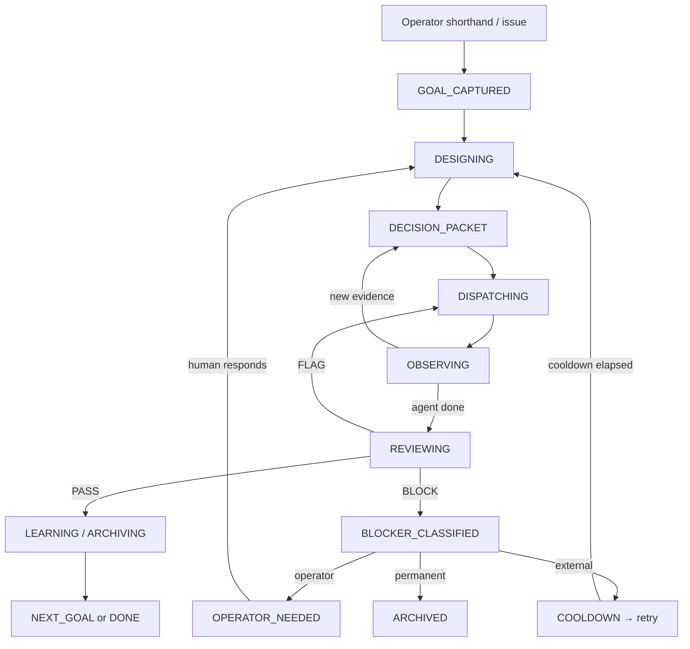

# Workbench Goal Mode v2

Use this skill when an issue contains `/goal`, `GOAL_MODE: yes`, `GOAL_MODE_V2`,
or asks the workbench to complete an objective autonomously across multiple
agents, turns, and evidence gates until a real blocker appears.

Goal Mode v2 is a persistent conductor, not a single-agent persistence wrapper.
It splits the workflow into two cooperating layers so the human does not need to
babysit windows, monitor every agent, or manually switch contexts.

## Architecture



### Layer 1: Design / Decision

Owned by the conductor (Admin or delegated design agent). Produces decision
packets, not raw execution spam.

Responsibilities:
- Refine operator intent into a scoped objective.
- Pull constraints, non-goals, blockers, and evidence expectations from durable
  memory (SYNTHESIS.md, DECISIONS.md, prior issue evidence).
- Choose the Friction Tier and applicable gates (SDD, L2 Pressure, Capy check).
- Maintain taste, scope, blocker semantics, and evidence standards.
- Ask the operator only when a real design trade-off needs human judgment.

### Layer 2: Dispatch / Operations

Owned by the dispatcher (Admin or Supervisor). Converts decision packets into
bounded Multica issues, monitors them, and routes follow-ups.

Responsibilities:
- Convert one decision packet into one or more bounded issues.
- Assign one owner per issue. Mention specialists only for narrow review.
- Monitor active / in_review / blocked / done states via `multica issue list`.
- Re-route only when new evidence changes state — never re-sweep unchanged work.
- Stop when only operator-call or external-platform blockers remain.

## State Machine

| State | Meaning | Next |
|-------|---------|------|
| `GOAL_CAPTURED` | Shorthand or issue received, not yet designed | `DESIGNING` |
| `DESIGNING` | Conductor is pulling context, refining intent, checking memory | `DECISION_PACKET` or `OPERATOR_NEEDED` |
| `DECISION_PACKET` | Scoped route produced, ready to dispatch | `DISPATCHING` |
| `DISPATCHING` | One or more bounded issues created/assigned | `OBSERVING` |
| `OBSERVING` | Waiting for agent evidence; periodic status scan | `REVIEWING`, `DECISION_PACKET` (re-route), or `BLOCKER_CLASSIFIED` |
| `REVIEWING` | Evidence evaluated against closeout gates | `LEARNING` (PASS), `DISPATCHING` (FLAG), or `BLOCKER_CLASSIFIED` (BLOCK) |
| `BLOCKER_CLASSIFIED` | Blocker typed: operator / external / permanent | `OPERATOR_NEEDED`, cooldown → `DESIGNING`, or `ARCHIVED` |
| `LEARNING / ARCHIVING` | Evidence harvested, noise archived, memory updated | `NEXT_GOAL` or `DONE` |
| `OPERATOR_NEEDED` | Waiting for human input | `DESIGNING` (on response) |
| `DONE` | Objective achieved, all gates passed | terminal |

## Decision Packet Format

Every decision packet must be posted as a structured comment before any issues
are created:

```text
DECISION_PACKET
goal_id: <goal-shorthand-or-issue-id>
intent: <one-sentence objective>
route: <chosen execution path — which agents, skills, lanes>
owner: <primary executing agent>
reviewer: <who verifies evidence>
constraints: <non-negotiables, boundaries, blocked lanes>
evidence_expectations: <what proves success — exact artifacts or checks>
non_goals: <explicit exclusions>
blocker_conditions: <what would block this route>
tier: fast | standard | heavy
dedupe_key: <canonical key to prevent duplicate dispatch>
max_active: <max concurrent in_progress issues for this goal>
cooldown_minutes: <minimum minutes before next sweep or re-route>
verdict: READY_TO_DISPATCH | NEEDS_DESIGN | OPERATOR_NEEDED
```

## Dedupe, Cooldown, and Noise Controls

These prevent the controller from accumulating endless sweeper issues (per
DAS-741 / DAS-743 findings):

### Dedupe
- Before creating any issue, check if an equivalent issue already exists using
  the `dedupe_key`. Match on title prefix + active status (not done/cancelled).
- If an equivalent issue exists and is `in_progress` or `in_review`, do not
  create a duplicate. Post a status note on the existing issue instead.
- If an equivalent issue exists and is `blocked`, check if the blocker changed
  before re-dispatching.

### Cooldown
- After dispatching a decision packet, set `cooldown_minutes`. Do not scan or
  re-route for this goal until the cooldown elapses.
- Default cooldown: 15 minutes for standard work, 30 minutes for heavy work.
- Cooldown resets when a new decision packet is dispatched.

### Max Active
- No more than `max_active` (default: 5) issues may be `in_progress` for a
  single goal at any time.
- If the limit is reached, new dispatch waits until an active issue moves to
  `in_review` or `done`.

### Archive and Cancel Semantics
- Completed (`done`) issues: harvest evidence, then archive — do not re-read or
  re-route.
- Stale `in_review` issues (no activity for 48h): post one nudge, then flag for
  Supervisor.
- Noise issues (created in error, duplicate, superseded): set to `cancelled`
  with a one-line reason. Do not leave them in `blocked`.
- The conductor itself must have a self-cancel condition: if the conductor issue
  is the only remaining active issue and all dispatched work is `done` or
  `cancelled`, post the final verdict and stop.

## Autonomy Guards

The conductor may act autonomously when:
- The decision packet is `READY_TO_DISPATCH`.
- No operator-call conditions are triggered.
- Dedupe confirms no duplicate work exists.
- The route does not touch blocked lanes (DAS-696, DAS-693, or operator-declared
  frozen lanes).
- Workbench Max is not in the route.

The conductor MUST call the operator when:
- A design trade-off needs human taste judgment (not just more context).
- A permission, secret, payment, or runtime mutation is required.
- A blocked lane is the only viable route.
- Two prior attempts at the same sub-task failed with different approaches.
- The dedupe key matches an existing active issue with a different decision
  packet (route conflict).

## Composition With Existing Layers

Goal Mode v2 composes with, but does not replace:

| Layer | How Goal Mode v2 uses it |
|-------|--------------------------|
| Friction Tier Router | Selected during DESIGNING; encoded in decision packet tier field |
| SDD | Decision packet may route heavy work through SDD stages; design layer handles Raw Requirement + Product Design |
| L2 Pressure Gate | Applied during DESIGNING when objective touches remote/HarnessMax/leaderboard work |
| Goal Mode v1 | v2 replaces the persistence wrapper; v1 skill remains for simple single-agent /goal tasks |
| Auto Review Sweeper | Dispatch layer uses sweeper results during OBSERVING → REVIEWING transition |
| Self-Awareness | Run once at GOAL_CAPTURED for heavy-path goals before DESIGNING begins |
| Completion Cooling | Applied to dispatched child issues at 75/85/90/100 thresholds |

## Activation

When activated by `/goal` or `GOAL_MODE: yes`, the conductor must:

1. Post `GOAL_LOCK` with objective, owner, non_goals, closeout gates, and
   operator-call conditions.
2. If Heavy Path: post `SELF_AWARENESS_BOOTSTRAP` before designing.
3. If L2_PRESSURE: post `RV_PRESSURE_CHECK` before routing.
4. Enter `DESIGNING` → produce `DECISION_PACKET` → enter `DISPATCHING`.
5. Continue the observe → review → archive → next-goal loop until DONE or
   OPERATOR_NEEDED.

## Closeout Contract

```text
GOAL_MODE_V2_CLOSEOUT
goal_id:
objective:
state_machine_path: <trace of states visited, e.g. GOAL_CAPTURED→DESIGNING→...→DONE>
decision_packets_produced: <count>
issues_dispatched: <count and IDs>
evidence_harvested: <summary of completed evidence>
noise_cancelled: <count and IDs of cancelled duplicates>
operator_calls: <count and reasons, if any>
residual_risk:
archive_actions_taken:
verdict: PASS | FLAG | BLOCK
```

## Validation

Before claiming DONE, verify:
- Every dispatched issue has a verdict (PASS/FLAG/BLOCK) or is properly cancelled.
- No duplicate active issues share the same dedupe_key.
- The conductor's self-cancel condition is satisfied.
- Evidence is posted on the goal issue, not scattered across child comments.
- `OPERATOR_NEEDED` was raised for every case where the conductor lacked authority.
